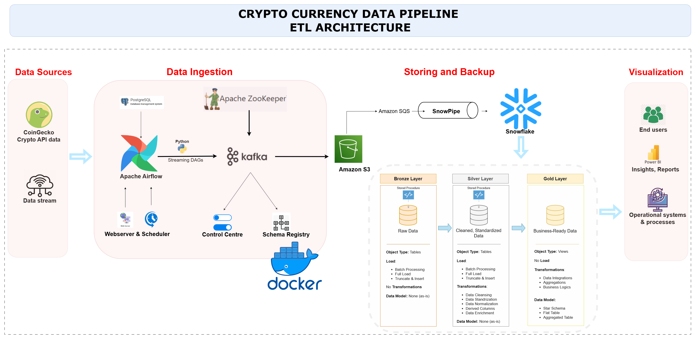
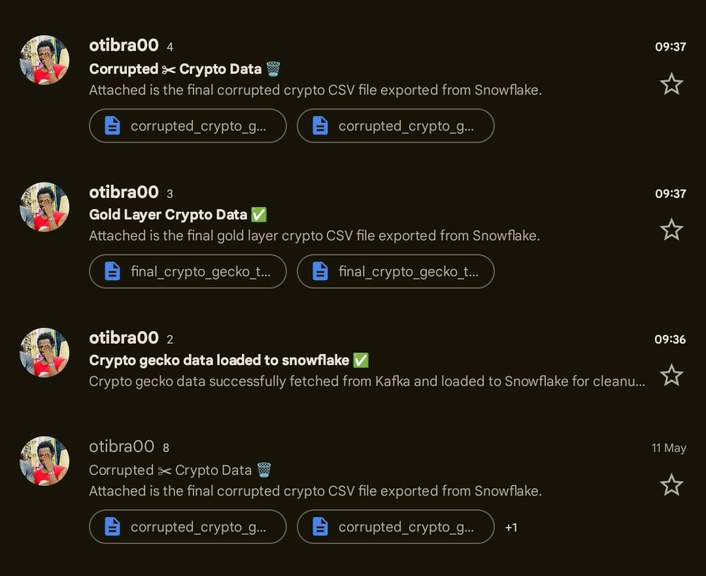

# CryptoCurrency Tracking Data Pipeline

## Overview

An end-to-end **Crypto Currency Data Pipeline** that ingests real-time cryptocurrency data from the CoinGecko API using Apache Airflow and Kafka, processes it through a medallion architecture (Bronze → Silver → Gold) in **Snowflake**, and sends processed CSV reports via email. Built and containerized using **Docker**.

## Architecture

The pipeline follows a robust architecture with clear separation of concerns, leveraging industry-standard tools and technologies. Below is a high-level overview of the architecture:



### Key Components

1. **Data Sources**
   - **CoinGecko API**: Real-time cryptocurrency data.
   - **Data Stream**: Continuous data ingestion from Kafka.

2. **Data Ingestion**
   - **Apache Airflow**: Orchestrates the data pipeline using DAGs.
   - **Kafka**: Handles streaming data ingestion.
   - **Schema Registry**: Ensures data consistency and schema validation.
   - **Control Centre**: Monitors and manages the pipeline.

3. **Storing and Backup**
   - **Amazon S3**: Temporary storage for raw and processed data.
   - **Snowflake**: Central data warehouse for storing cleaned and transformed data.
   - **Snowpipe**: Real-time data loading into Snowflake.

4. **Visualization**
   - **Power BI**: Generates insights and reports for end-users.
   - **Operational Systems**: Integrates with business processes for real-time decision-making.

## 📁 File Structure

The repository is organized as follows:
```
CryptoDataPipeline/
├── dags/
│   ├── sqls/
│   │   ├── bronze_crypto_load.sql
│   │   ├── silver_crypto_load.sql
│   │   ├── gold_crypto_load.sql
│   │   ├── corrupted_data.sql
│   │   └── snow_pipe.sql
│   ├── coin_fetch.py           # Fetches data from CoinGecko API
│   ├── coin_consume.py         # Kafka consumer for raw messages
│   ├── corrupted_data.py       # Identifies corrupted records
│   ├── final_table_to_mail.py  # Sends final CSV to email
│   └── snowflake_table.py      # Snowflake table manager
├── docker-compose.yml
├── Dockerfile
├── requirements.txt
├── etl_architect.png
├── etl_architecture.drawio
├── csv_data_mails.jpg          # Screenshot proof of emailed CSVs
```

---

### 🔁 Medallion Architecture (Bronze → Silver → Gold)

* **Bronze Layer**: Raw CoinGecko crypto data
* **Silver Layer**: Cleaned, enriched, and normalized data
* **Gold Layer**: Business-ready data (aggregated, integrated, and analytics-optimized)

---

## ✉️ Email Reports

CSV reports are automatically generated and emailed upon successful execution of the pipeline:

* ✅ Gold Layer CSV (clean and analytics-ready)
* 🗑️ Corrupted Data CSV (isolated for inspection)

*See proof below:*



---

## 🧰 Tech Stack

| Tool           | Purpose                                     |
| -------------- | ------------------------------------------- |
| Python         | Core programming and scripting              |
| Apache Airflow | Orchestration of DAGs                       |
| Kafka          | Real-time data ingestion                    |
| Docker         | Containerization of services                |
| Amazon S3      | Raw data storage                            |
| Snowflake      | Cloud data warehouse and transformation     |
| Snowpipe       | Automated data loading from S3 to Snowflake |
| Power BI       | Final visualization layer (optional)        |

---

## 🚀 How It Works

1. **Data Fetching**: Airflow DAG fetches crypto data from CoinGecko API.
2. **Streaming**: Data is streamed into Kafka using producers and consumers.
3. **Storage**: Kafka pushes to Amazon S3 → Snowpipe loads into Snowflake.
4. **Transformation**: SQL stored procedures transform raw data to gold.
5. **Notification**: Clean and corrupted CSVs are emailed as attachments.

---


## Setup and Installation

### Prerequisites

- **Docker**: Ensure Docker is installed on your machine.
- **Docker Compose**: Required for running the pipeline in a containerized environment.
- **Snowflake Account**: Access to a Snowflake account for data storage.
- **CoinGecko API Key**: Obtain an API key from CoinGecko for data fetching.

## 🛠️ Setup Instructions

1. **Clone the Repository**

2. **Start Docker Containers**

3. **Access Airflow**  `http://localhost:8080` and trigger your DAGs.

4. **Ensure Kafka & Snowflake Credentials Are Set**

---

## 📬 Output Examples

* **Gold CSV**: `final_crypto_gecko_table.csv`
* **Corrupted CSV**: `corrupted_crypto_gecko.csv`

Both are sent via email. File names and counts visible in [`csv_data_mails.jpg`](./csv_data_mails.jpg).

---

## 📌 Future Improvements

* Implement real-time dashboards in Power BI
* Automate anomaly detection in corrupted data
* Expand coverage to multiple crypto data APIs

---

- ## 🛡️ License

This project is licensed under the [MIT License](LICENSE). You are free to use, modify, and share this project with proper attribution.

#### **Contact**
For any questions or feedback, please reach out to:

[](https://dev.to/brian_otina_)
[](https://github.com/otinabrayo)
[](https://www.linkedin.com/in/brian-makau-3a93b6354?utm_source=share&utm_campaign=share_via&utm_content=profile&utm_medium=android_app)
[](mailto:brianotina20@gmail.com)
[](https://t.me/just_otina)
[](https://discord.com/channels/@otina_)

---
Feel free to customize this README further based on additional specifics or requirements of your project!
